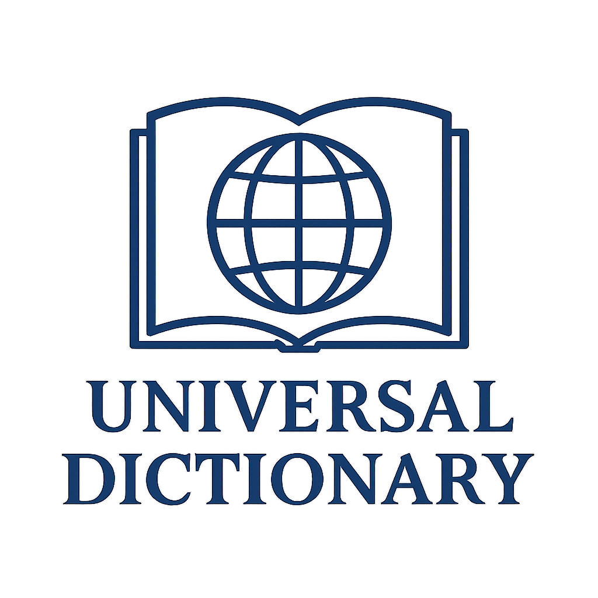

# 🌍 Universal Dictionary

  

O **Universal Dictionary** é um projeto online que reúne palavras e expressões de diferentes países ao redor do mundo, organizadas por continente.  
Nosso objetivo é facilitar o acesso a vocabulário, significados e traduções, promovendo o aprendizado cultural e linguístico de forma simples e acessível.

---

## 🌎 Estrutura do Site

O conteúdo está organizado por **continentes**, cada um contendo os países e suas respectivas palavras/expressões:

- **América**  
  - Palavras de países como Brasil, Estados Unidos, México, Argentina, Canadá e outros.  
- **Ásia**  
  - Vocabulário de países como Japão, China, Índia, Coreia do Sul, Arábia Saudita e mais.  
- **Europa**  
  - Termos vindos de Portugal, França, Alemanha, Espanha, Itália, Reino Unido e demais países europeus.  

Cada entrada conta com:  
- ✅ A palavra original  
- ✅ Tradução para outros idiomas  
- ✅ Breve explicação ou contexto cultural  

---

## 🚀 Tecnologias Utilizadas

- **Laravel** – framework PHP para desenvolvimento backend  
- **PHP 8+** – linguagem principal do servidor  
- **Bootstrap 5** – para design responsivo e componentes de interface  

---

## 📚 Objetivos do Projeto

- Criar um **repositório linguístico universal**.  
- Incentivar o **aprendizado de línguas** e a troca cultural.  
- Facilitar o **acesso rápido** a palavras e significados em diversos idiomas.  

---

💡 **Universal Dictionary** – Um mundo de palavras ao seu alcance.